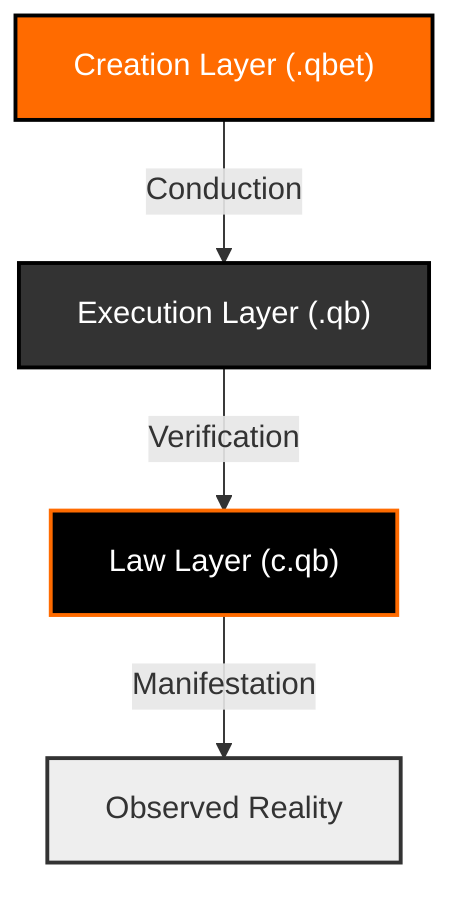

<div align="center">
  
  <h1>QBET: The Sovereign Reality Engine</h1>
  <p><b>State-of-the-Art Reality Creation Framework // Conduction v1.0</b></p>
  <br>
  <a href="https://snapcraft.io/qbet"></a>
  <a href="https://opendev-labs.github.io/QBET/"></a>
  <br><br>
</div>

---

## 💎 The Sovereign Objective

QBET (Quantum Binding & Emergence Toolchain) is a **High-Performance Sovereign Language** designed for the deterministic manifestation of complex systems. While languages like **Go** focus on concurrency and **Ruby** on developer happiness, QBET focuses on **Law-Governed Integrity**.

It provides a unified conduction layer that bridges high-level human intention with mechanical physical laws, ensuring that reality is exactly as declared.

### 🚀 Key Performance Indicators
*   **Zero-Entropy Conduction**: Strict separation of intent from execution.
*   **Law-Bound Safety**: All manifestations are verified against the Kernel Law Contract.
*   **Universal Portability**: Distributed via Snap for immediate global presence.
*   **Aesthetic Excellence**: Designed for the conductors of 2037.

---

## 🏛️ The Three-Layer Authoritative Architecture

QBET enforces a strict hierarchy to maintain systemic coherence. This 3-layer model prevents the logical decay found in classical imperative languages.



### 1. Creation Layer (`.qbet`)
The domain of **Declaration**. Non-imperative logic where the conductor defines the properties and intentions of the field.

### 2. Execution Layer (`.qb`)
The domain of **Collapse**. A minimal, high-speed mechanical instruction set (IR) generated from the Creation Layer.

### 3. Law Layer (`c.qb`)
The domain of **Physical Constant**. A permanent contract that defines the boundaries of what can exist within the QBET field.

---

## ⚡ Quick Start: Manifesting Reality

QBET is distributed as a global snap for effortless installation across all Linux environments.

```bash
# Install the Conductor via Snap Store
sudo snap install qbet
```

### Manifest Your First Universe
```bash
# Initialize a new declaration
qb create my_reality.qbet

# manifest the intention into reality
qb manifest my_reality.qbet
```

---

## 🏛️ Sovereign Repository Structure

| Directory | Layer | Purpose |
| :--- | :--- | :--- |
| `kernel/` | **Engine** | The Python-based Conductor core. |
| `laws/` | **Law** | Immutable Kernel Law Contracts (c.qb). |
| `universes/` | **Creation** | User-defined reality declarations. |
| `lowered/` | **Execution** | Canonical IR (.qb) instruction sets. |
| `docs/` | **Portal** | Branding, UI, and Documentation. |

---

## 🛡️ Governance & Sovereignty

QBET is an authoritative project exclusively governed by **opendev-labs**. It is built for those who demand total control over their digital manifestations.

*“If you speak it in QBET, the kernel makes it law.”* — **The Conductor**

---

<div align="center">
  <p>© 2026 opendev-labs // Stabilized Reality // </p>
</div>
